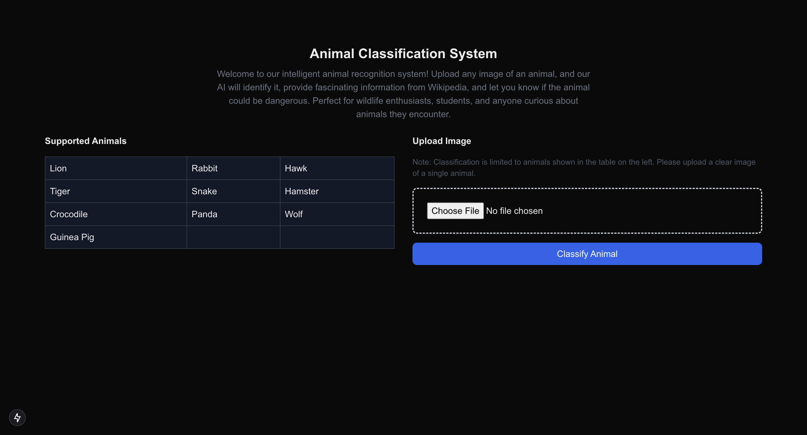

# Week 5 Project - AI GPT Bootcamp Q4 2024 - Encode Club

## Project Description
**Discover the world of wildlife with our intelligent animal recognition system!** 
This web application allows users to upload images of animals, 
automatically classifies the animal using a powerful Computer Vision model, and provides fascinating information from Wikipedia. 
The app also determines if the detected animal is dangerous, offering a seamless and interactive way to explore and learn about wildlife.

Perfect for wildlife enthusiasts, students, and anyone curious about the animals they encounter, 
this application brings the wonders of nature right to your fingertips!


## Prerequisites
Before you begin, ensure you have met the following requirements:

1. **Node.js Installation**
    - Node.js version 18 or later (this project uses Node.js 20)
    - Download from [nodejs.org](https://nodejs.org)
    - If using `nvm`, switch to Node.js 20 with:
      ```bash
      nvm use 20
      ```

2. **OpenAI API Key**
    - Create an account at [OpenAI Platform](https://platform.openai.com)
    - Generate an API key from your OpenAI dashboard
    - Create a `.env` file in the root directory
    - Add your API key:
      ```plaintext
      OPENAI_API_KEY=your_api_key_here
      ```

3. **Python Setup**
    - Python 3.8 or later
    - pip (Python package installer)


### Running the Project
Follow these steps:

1. **Clone the Repository**
   ```bash
   git clone https://github.com/ifanzalukhu97/Week-5-Project-AI-GPT-Bootcamp-Q4-2024-Encode-Club.git
   cd Week-5-Project-AI-GPT-Bootcamp-Q4-2024-Encode-Club
    ```

2. **Set Up Backend Server**
    ```bash
   cd backend-server
   
   # Create virtual environment
   python -m venv .venv
   
    # Activate virtual environment
    # For macOS/Linux:
    source .venv/bin/activate
   
    # For Windows:
    .\venv\Scripts\activate
    
    # Install dependencies
    pip install -r requirements.txt
    
    # Start the server
    python -m clip_server config.yml
   ```
   
3. Verify Server Status Visit http://0.0.0.0:51000/status in your browser.

4. **Set Up Frontend**
    ```bash
    cd client-frontend
    npm install
    
    # Create .env and add API key
    echo "OPENAI_API_KEY=your_api_key_here" > .env
    
    # Start development server
    npm run dev
    ```

5. Access the Application Open http://localhost:3000 in your browser.


## Report / Documentation



## Contributors
- [Ifanzalukhu97](https://github.com/ifanzalukhu97) (ID: oBklq0)
